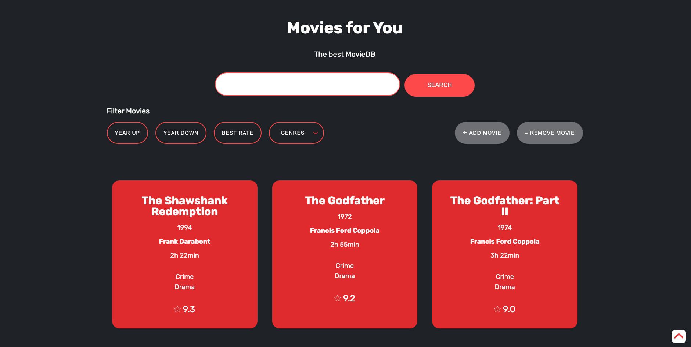
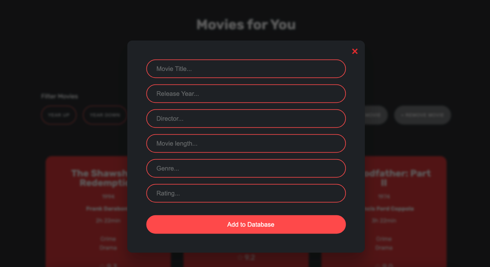
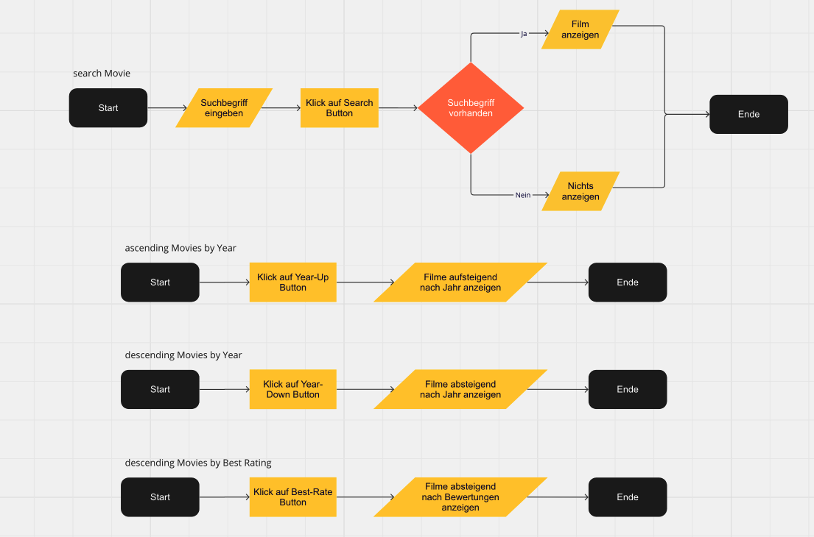
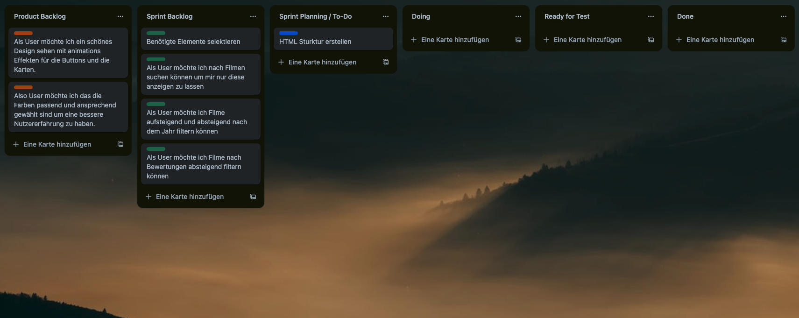
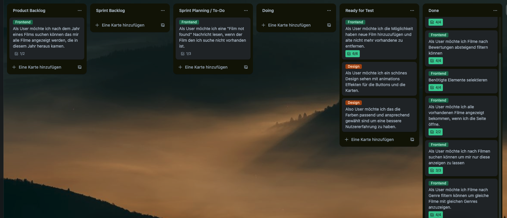

# Movie Database

In diesem Projekt finden sich Filme. Nach den Filmen kann gesucht werden, entweder nach dem Filmtitel oder nach dem Veröffentlichungsjahr. Die jeweiligen Filme werden dann ausgegeben. Außerdem gibt es unterschiedliche Filter nach denen Filme gefiltert werden können. Zusätzlich können neue Filme hinzugefügt werden und nicht mehr vorhandene können aus der Datenbank gelöscht werden.

## Inhaltsverzeichnis

- [Overview](#overview)
  - [Screenshot](#screenshot)
  - [Links](#links)
- [My process](#my-process)
  - [Built with](#built-with)
  - [What I learned](#what-i-learned)
  - [Continued development](#continued-development)
  - [Useful resources](#useful-resources)
- [Author](#author)

## Überblick

### Screenshot

#### Desktop:

#### Modal for adding movie

#### Flowchart

#### Starting Project

#### Project in Progress

### Links

- Lösung URL: [index.html](https://github.com/wilhelm-lenz/movie-database/blob/main/index.html)
- Lösung URL: [style.css](https://github.com/wilhelm-lenz/optimalgewicht-rechner/blob/main/assets/css/style.css)
- Lösung URL: [main.js](https://github.com/wilhelm-lenz/optimalgewicht-rechner/blob/main/assets/js/main.js)
- Live Seite URL: [Movie Database Live](https://github.com/wilhelm-lenz/movie-database)

## Mein Prozess

### Verwendete Technologien

- Semantic HTML5 markup
- SCSS custom properties
- JavaScript

### Erkenntnisse

Während der Entwicklung dieser Anwendung habe ich verschiedene Herausforderungen im Zusammenhang mit der HTML-Struktur und der JavaScript-Logik gemeistert. Es ist entscheidend, den Code sauber und modular zu halten, um spätere Anpassungen oder Erweiterungen zu erleichtern.

### Weitere Entwicklung

In der nächsten Entwicklungsphase liegt der Fokus auf der Refaktorisierung des Codes zur Verbesserung der Modularität. Zudem wird darauf geachtet, Best Practices zu befolgen und den Code allgemein schlanker zu gestalten. Auch die HTML-Struktur wird für mehr Semantik überarbeitet.

### Nützliche Ressourcen

- Netlify - [@app.netlify](https://app.netlify.com/drop/) [@netlify](https://netlify.com): Netlify ist eine Entwicklungsplattform, die es ermöglicht, eine Webanwendung zu skalieren. Zum Beispiel kann eine programmierte Webanwendung leicht in eine mobile Web-App umgewandelt werden.

## Autor

- Wilhelm Lenz - [@wilhelm-lenz](https://github.com/wilhelm-lenz)
